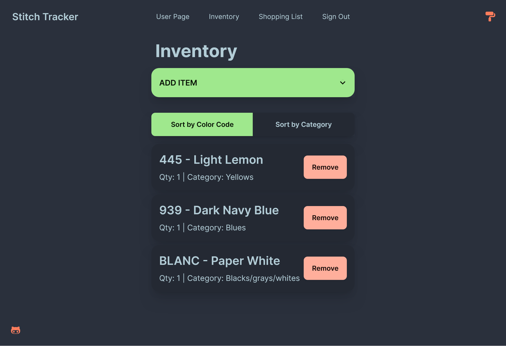
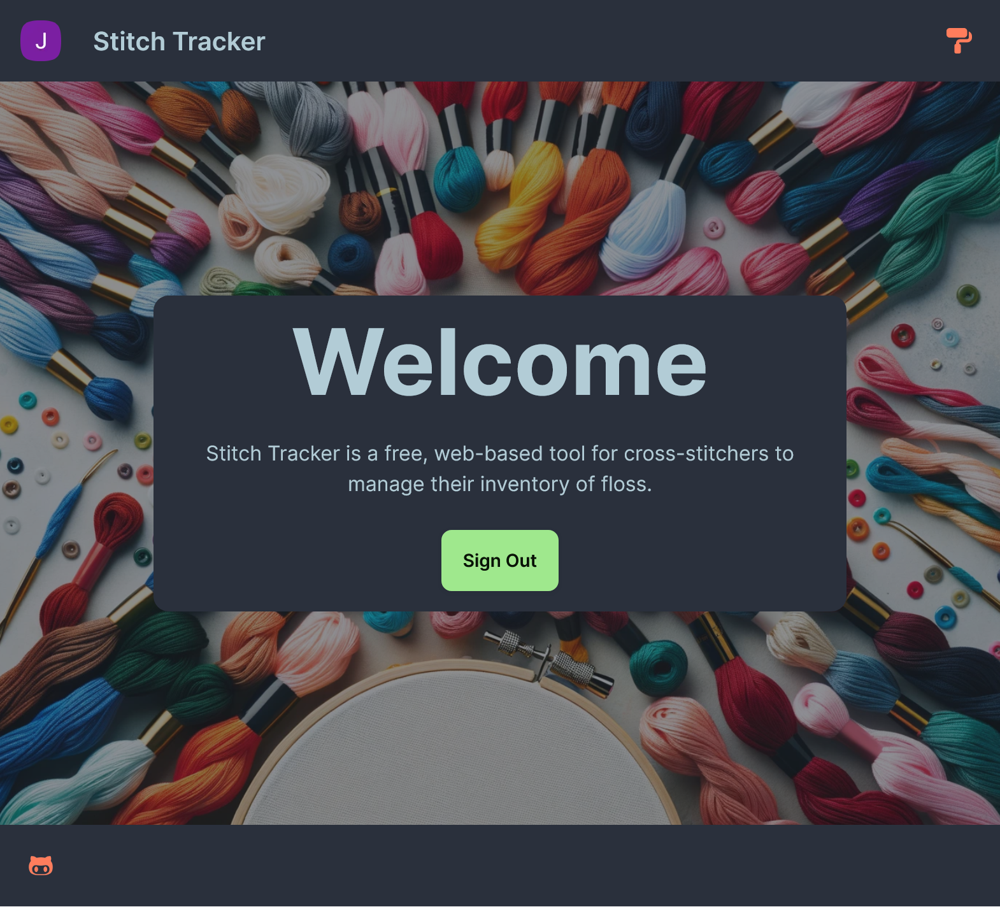
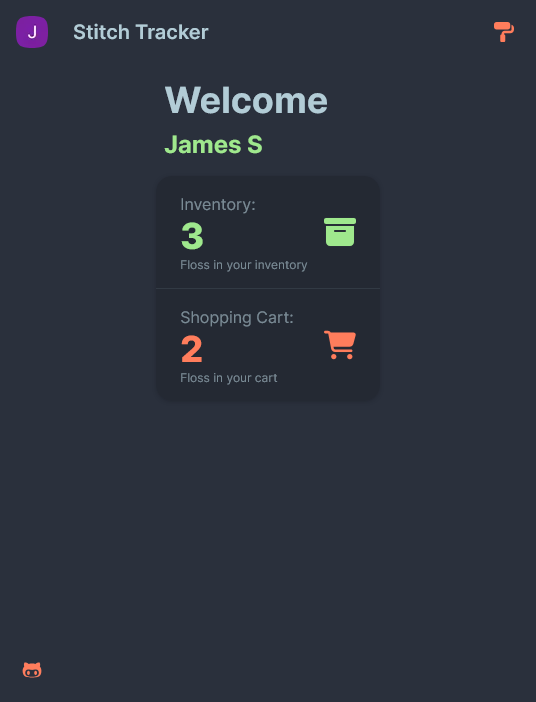
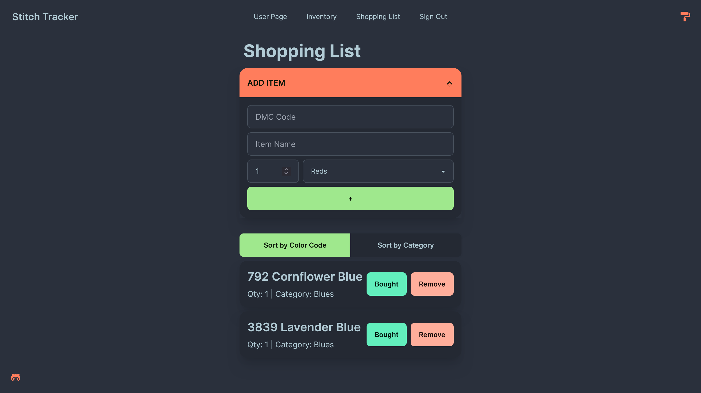

# 🧵 Stitch Tracker

A web application for tracking cross-stitch supplies and shopping lists. Designed to help crafters manage their inventory and avoid buying duplicate floss.



## ✨ Features

- **Inventory Management** – Keep track of owned floss and supplies.
- **Shopping List** – Add missing colors to a shopping list.
- **Google Authentication** – Secure login using Firebase.
- **Responsive UI** – Optimized for mobile and desktop.
- **Dark Mode Support** – (If applicable)

## 📸 Screenshots

| Home Screen                             | Dashboard                            |
| --------------------------------------- | ------------------------------------ |
|  |  |

| Inventory Screen                     | Shopping List                                |
| ------------------------------------ | -------------------------------------------- |
|  |  |

## 🚀 Installation & Setup

To run this project locally, follow these steps:

### 1️⃣ Clone the Repository

```sh
git clone https://github.com/yourusername/stitch-tracker.git
cd stitch-tracker
```

### 2️⃣ Install Dependencies

```sh
npm install
# or
yarn install
```

### 3️⃣ Set Up Firebase

Create a .env.local file and add your Firebase API keys:

```in
    NEXT_PUBLIC_FIREBASE_API_KEY=your_api_key
    NEXT_PUBLIC_FIREBASE_AUTH_DOMAIN=your_auth_domain
    NEXT_PUBLIC_FIREBASE_PROJECT_ID=your_project_id
```

(If using Firestore, also set up database rules.)

### 4️⃣ Run the App

```sh
npm run dev

# or

yarn dev
```

The app will be available at http://localhost:3000

## 🛠️ Tech Stack

- Next.js – React framework
- Firebase – User authentication & Firestore database
- Tailwind CSS & DaisyUI – Styling

## 🤝 Contributing

If you have suggestions or improvements, feel free to open an issue or submit a pull request!

## 📜 License

## License

This project is open source and available under the [MIT License](LICENSE).
